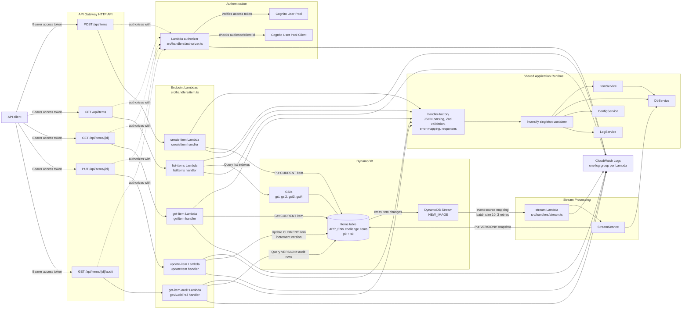

# Architecture Documentation

## Overview

The API is a serverless TypeScript application. API Gateway HTTP API invokes one Lambda per route. Each route uses a shared handler factory for JSON parsing, Zod validation, error mapping, and response formatting. The handler factory defaults successful responses to `200`, and callers can choose a strongly typed success status from the supported `2xx` set when an endpoint needs different semantics, such as `201` for item creation or `204` for no-content updates. Business logic lives in `ItemService`, which implements the `ItemStorage` interface and is resolved through an Inversify singleton container. The application uses dependency injection / inversion of control to bind singleton services in that container and pass those shared dependencies through service constructors. `ConfigService` maps environment variables into typed runtime config, and `LogService` centralizes `debug`, `info`, `warn`, and `error` logging. 

Item request validation uses shared TypeScript enums for `itemType`, `metadata.status`, and `securityLevel`, so the public wire values and service types stay aligned.

## Architecture Diagram



## DynamoDB Design

The table is named `{APP_ENV}-challenge-items` and uses a single-table design.

The primary key attributes and GSI attributes are intentionally named generically (`pk`, `sk`, `gsi_pk`, `gsi_sk`, `gsi2_pk`, `gsi2_sk`, etc.). In a single-table design, each entity schema owns the meaning of its key values, so generic attribute names let future entity types add their own partition/sort key patterns without renaming table-level attributes or creating entity-specific indexes.

Base keys:

```text
pk          string
sk          string
```

Item records:

```text
pk            sk
ITEM#<id>     CURRENT
ITEM#<id>     VERSION#000001
ITEM#<id>     VERSION#000002
```

`CURRENT` stores the latest item. `VERSION#...` records store immutable version snapshots for audit history.

Generic GSIs support cross-item list access patterns:

```text
gsi:  gsi_pk,  gsi_sk   all current items
gsi2: gsi2_pk, gsi2_sk  current items by subject
gsi3: gsi3_pk, gsi3_sk  current items by status
gsi4: gsi4_pk, gsi4_sk  current items by subject + status
```

Only `CURRENT` rows include GSI attributes. Version rows do not project into list queries.

## Access Patterns

- `POST /api/items`: writes the `CURRENT` item and returns `201` with the created item. The DynamoDB Stream invokes the stream Lambda, which writes `VERSION#000001`.
- `GET /api/items/{id}`: reads `pk = ITEM#<id>`, `sk = CURRENT`, and returns `200`.
- `PUT /api/items/{id}`: atomically updates defined fields on `CURRENT`, increments version, and returns `204`. The DynamoDB Stream invokes the stream Lambda, which writes the new `VERSION#...`.
- `GET /api/items`: queries `gsi`, `gsi2`, `gsi3`, or `gsi4` depending on filters and returns `200`.
- `GET /api/items/{id}/audit`: queries `pk = ITEM#<id>` with `begins_with(sk, VERSION#)` and returns a paged `200` result.

## Performance

The write path keeps the main create and update endpoints focused on the current item only. Version snapshot creation is deferred to DynamoDB Streams and the `stream` Lambda, so API requests do not wait for an additional audit-history write before returning. DynamoDB Streams only emits records after successful item-level table changes, which means reads, validation failures, and failed conditional writes do not notify the versioning worker.

DynamoDB Streams provides exactly-once delivery guarantees while Lambda event source mappings provide at-least-once delivery. This design still avoids duplicate audit rows because version writes are idempotent: version records use deterministic keys, `pk = ITEM#<id>` and `sk = VERSION#<version>`. If the same stream event is retried, the stream Lambda writes the same version key again rather than creating a second version row.

Updates are also granular. The update endpoint builds DynamoDB `UpdateExpression` statements for defined fields, including deeply nested item fields such as `detail.metadata.status`. That lets the API update only the requested attributes and increment `detail.metadata.version` atomically, without first reading the full item, mutating it in memory, and writing the whole object back. The result is fewer round trips, smaller writes, and less risk of overwriting unrelated fields.

## Pagination

List and audit endpoints use cursor pagination. DynamoDB `LastEvaluatedKey` is encoded as an opaque base64url `cursor`. The next request decodes that cursor into `ExclusiveStartKey`. Malformed cursors return `400`.

## Test Coverage

The unit test suite currently reports 100% coverage for statements, branches, functions, and lines. Full unit coverage gives the core API, service, storage, stream, and CDK paths a tight regression net: validation behavior, error mapping, DynamoDB command construction, idempotent stream versioning, pagination, and infrastructure synthesis are all exercised in fast tests. That coverage makes refactoring safer, documents expected edge cases in executable form, and helps keep behavior stable as the architecture evolves.

TODO: add targeted integration tests for important business user stories that cross Lambda, API Gateway-style request handling, DynamoDB, and stream behavior:

- Create an item, confirm the API returns `201`, then verify the current item and initial audit version are persisted.
- Update deeply nested item metadata, confirm the API returns `204`, then verify only intended fields changed and a new audit version appears asynchronously.
- List items by subject, status, and subject + status filters, including cursor pagination across multiple pages.
- Reject unauthenticated or invalid-token requests before route Lambda business logic runs.

## Security

CDK creates a Cognito User Pool and app client per environment. API Gateway uses a Lambda authorizer that validates Cognito access tokens. Route Lambdas and the stream Lambda receive DynamoDB permissions scoped to this table. Unknown exceptions are logged and returned as `{ "error": "An internal error occurred." }`.

The generic `500` response is intentional. Internal exception messages can expose implementation details, data shapes, dependency names, or operational state, so the handler factory logs the real error server-side and returns a public-safe message to clients. This supports SOC 2 security and confidentiality controls by limiting information disclosure while preserving enough detail in CloudWatch for operators to investigate.

`LOG_LEVEL` controls the minimum emitted log severity. Supported values are `debug`, `info`, `warn`, and `error`.

## Tradeoffs

This design optimizes the required read patterns without scans. The extra GSIs make list queries predictable, but writes update several index attributes on the current item. Version snapshots are simple to query and match the current `ItemStorage` interface, but they are eventually consistent with the current-item write because the stream Lambda creates them asynchronously. Richer audit events could be added later if the API needs actors, diffs, or operation metadata.
